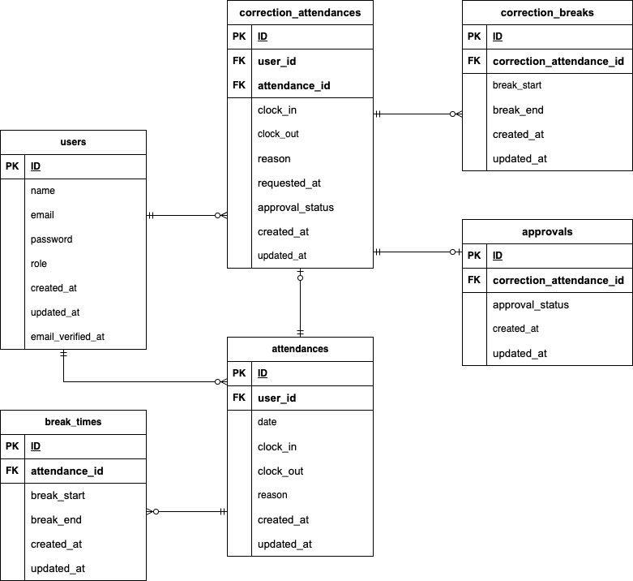

# COACHTECH 勤怠管理アプリ

## 環境構築

* リポジトリをクローン
```
git clone git@github.com:ri0921/attendance.git
```
* プロジェクト直下で以下のコマンドを実行
```
make init
```

## メール認証
mailtrapというツールを使用しています。<br>
以下のリンクから会員登録をしてください。<br>
https://mailtrap.io/

メールボックスのIntegrationsから 「laravel 7.x and 8.x」を選択し、<br>
.envファイルのMAIL_MAILERからMAIL_ENCRYPTIONまでの項目をコピー＆ペーストしてください。<br>
MAIL_FROM_ADDRESSは任意のメールアドレスを入力してください。

## テストアカウント
### 管理者
name: admin
email: admin@example.com
password: password

### 一般ユーザー
name: 山田　太郎
email: taro.y@example.com
password: password
-------------------------
name: 佐藤　花子
email: hanako.s@example.com
password: password
-------------------------
name: 西　伶奈
email: reina.n@example.com
password: password
-------------------------

## PHPUnitを利用したテスト
テスト用データベースの作成
```
docker-compose exec mysql bash
```
```
mysql -u root -p
```
※ パスワードはrootと入力
```
CREATE DATABASE demo_test;
```
※ .env.testingにもMAILの項目を設定してください。

以下のコマンドを実行
```
make test
```

### テスト実行コマンド
```
docker-compose exec php bash
```
1. 認証機能（一般ユーザー）
```
vendor/bin/phpunit tests/Feature/RegisterTest.php
```
2. ログイン認証機能（一般ユーザー）
```
vendor/bin/phpunit tests/Feature/UserLoginTest.php
```
3. ログイン認証機能（管理者）
```
vendor/bin/phpunit tests/Feature/AdminLoginTest.php
```
4. 日時取得機能
5. ステータス確認機能
```
vendor/bin/phpunit tests/Feature/AttendanceStatusDisplayTest.php
```
6. 出勤機能
```
vendor/bin/phpunit tests/Feature/ClockInTest.php
```
7. 休憩機能
```
vendor/bin/phpunit tests/Feature/BreakTimeTest.php
```
8. 退勤機能
```
vendor/bin/phpunit tests/Feature/ClockOutTest.php
```
9. 勤怠一覧情報取得機能（一般ユーザー）
```
vendor/bin/phpunit tests/Feature/UserAttendanceListTest.php
```
10. 勤怠詳細情報取得機能（一般ユーザー）
```
vendor/bin/phpunit tests/Feature/UserAttendanceDetailTest.php
```
11. 勤怠詳細情報修正機能（一般ユーザー）
```
vendor/bin/phpunit tests/Feature/UserStampCorrectionValidationTest.php
```
```
vendor/bin/phpunit tests/Feature/UserStampCorrectionTest.php
```
12. 勤怠一覧情報取得機能（管理者）
```
vendor/bin/phpunit tests/Feature/AdminAttendanceListTest.php
```
13. 勤怠詳細情報取得・修正機能（管理者）
```
vendor/bin/phpunit tests/Feature/AdminStampCorrectionValidationTest.php
```
14. ユーザー情報取得機能（管理者）
```
vendor/bin/phpunit tests/Feature/AdminStaffAttendanceListTest.php
```
15. 勤怠情報修正機能（管理者）
```
vendor/bin/phpunit tests/Feature/AdminStampCorrectionTest.php
```
16. メール認証機能
```
vendor/bin/phpunit tests/Feature/EmailVerificationTest.php
```


## 使用技術
* PHP 7.4.9
* Laravel 8.83.8
* MySQL 8.0.26
* Mailtrap


## ER図



## URL
* 開発環境：<http://localhost/>
* phpMyadmin：<http://localhost:8080/>
* Mailtrap：<https://mailtrap.io/>